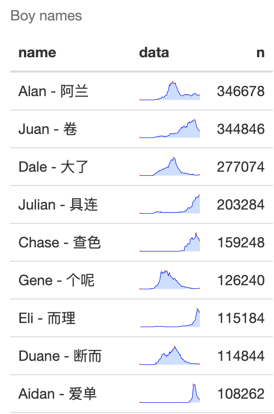

# Chinese names in US babynames

This post tries to pull all Chinese (pinyin) names from the US babynames dataset and visualize the trends. 

给在美的小孩取名字很麻烦啊，想起个中文名吧，又担心不好发音。光起英文名，作为中国人总归有些遗憾。 所以我尝试从那个SSA出的基于SSN的babynames数据集里找出一些符合拼音的名字。当然了，大多数出于发音问题不能用，但总归有些提示吧。

这是我几个月前写的，现在整理一下发出来

